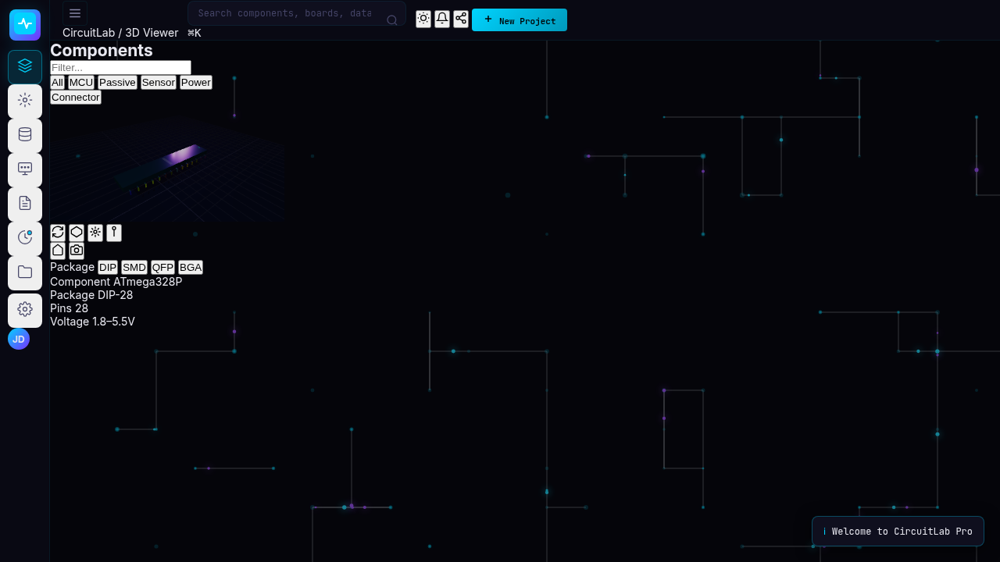
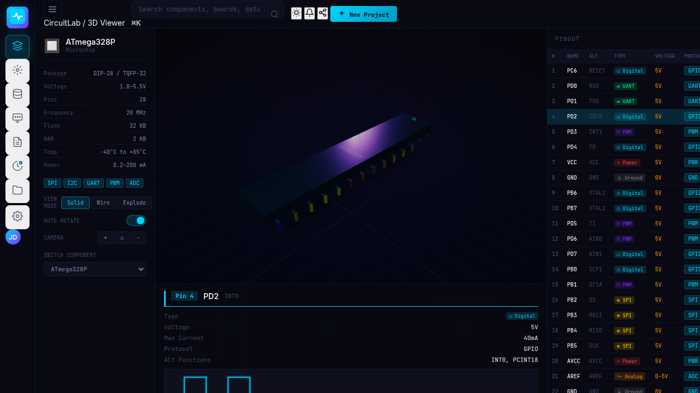
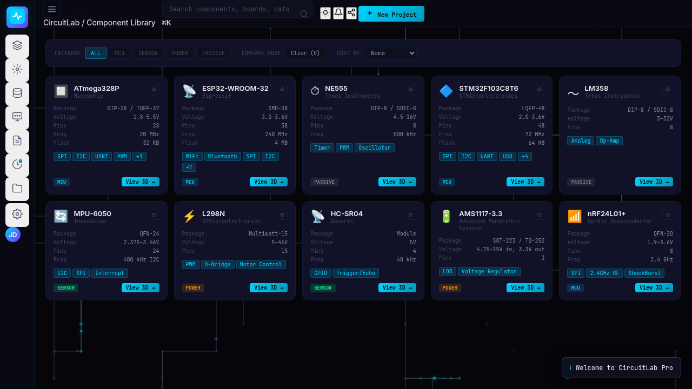
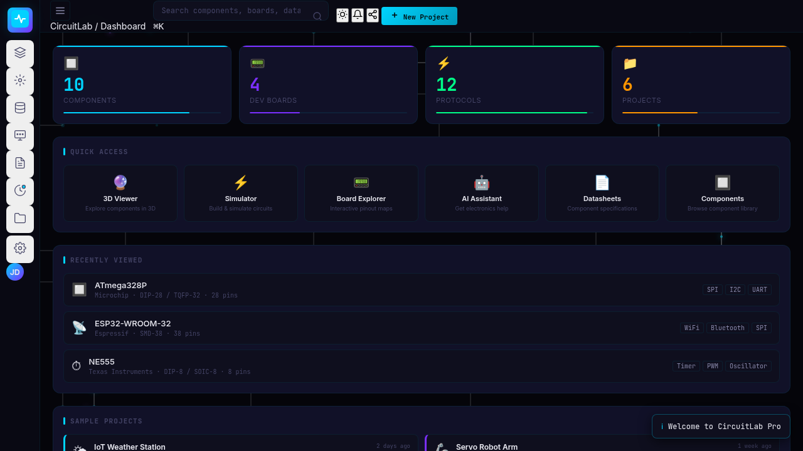
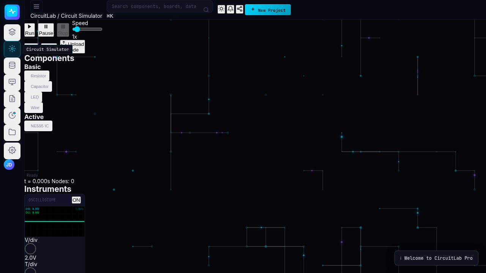

# 0002 — Which page markup each screen uses (F1)

- **Status:** Accepted
- **Date:** 2026-09-13
- **Replaces:** the rule "`index.html` is the source of truth for element IDs"

## Context

Two partial versions of the app are mixed together:

| Version | Files | Styled by today's CSS? |
|---|---|---|
| **Old** | `index.html` + `legacy/script.js` + `legacy/database.js` | ❌ 18% of `index.html` classes, 16% of `script.js` classes |
| **New** | `src/app/app.js` + `src/data/data.js` + `src/styles/main.css` | ✅ 88% of the HTML `app.js` generates. **But its page layout is missing.** |

The new CSS has one block per screen of the new design: Dashboard, Component Library, 3D Viewer, Simulator, Board Explorer, Datasheet, AI Assistant and Projects. It has no rules for the old-only screens (Database, Settings). Most B bugs (missing IDs) and the unstyled screens come from this mismatch.

### Measurements per screen

| Screen | Page classes (styled) | JS-generated classes (styled) | CSS block classes found in page / in JS |
|---|---|---|---|
| 3D Viewer | 56 (7) | 40 (**40**) | 2 / 29 |
| Simulator | 44 (9) | 0 | 7 / 0 |
| Database (old only) | 22 (6) | — | no CSS block |
| Component Library (new only) | — | 33 (32) | 0 / 25 |
| Dashboard (new only) | — | 36 (**36**) | 0 / 35 |
| Board Explorer | 23 (3) | 10 (2) | 2 / 0 |
| Datasheet | 22 (4) | 13 (8) | 2 / 8 |
| AI Assistant | 23 (2), 12 inline styles | 5 (1) | 0 / 1 |
| Projects | 9 (5) | 13 (11) | 2 / 2 |
| Settings (old only) | 11 (2), 22 inline styles | — | no CSS block |

Classes shared by every old screen (`glass-panel` ×22, `panel`, `panel-header`, `panel-title`, `view-title`, `view-subtitle`) have **no CSS at all**.

### Prototypes (scratch copy, no JS or CSS changes)

- **3D Viewer:** the page's viewer markup was replaced with the five containers the JS and CSS expect (`#viewer-sidebar`, `#viewer-canvas-area`, `#pin-detail-panel`, `#viewer-pin-panel` with `#pin-table-body`, `#pin-tooltip`). Result: a complete, styled viewer, with 0 errors, 28 pin rows and a 716×468 canvas (currently 300×150).
- **Component Library / Dashboard:** an empty `<section id="view-components">` / `<section id="view-dashboard">` was enough. Both render complete and styled.

| Current viewer | New layout (prototype) |
|---|---|
|  |  |

| Component Library (prototype) | Dashboard (prototype) |
|---|---|
|  |  |

Current simulator (canvas not visible, layout unstyled):

## Options considered

1. **Keep `index.html` everywhere.** Rewire all JS to the page, and write CSS for about 179 unstyled classes. This is the most work, and the Viewer's render code (already complete and styled) would need rewriting.
2. **New design everywhere.** Rebuild every screen to match the JS and CSS. The Simulator, Board Explorer and AI markup would have to be reconstructed from CSS names alone, and Settings has no CSS at all.
3. **Per screen: use whichever side is more complete.** ✅ Chosen.

## Decision

| Screen | Uses | What the fix branch does |
|---|---|---|
| **3D Viewer** | **New layout** | Replace the viewer markup with the five containers above. Fixes B4–B7 and most of C1. |
| **Database** | **New Component Library** | Show the Component Library in the Database screen (filters, compare, sort, cards). Fixes C3 and B8. |
| **Dashboard** | **New screen, becomes the home screen** | Add a sidebar item and make it the start screen. Keys become `1–9`. |
| **Simulator** | Current page | Line up the page's names with the CSS (the CSS uses `#sim-toolbar`, `#sim-palette`, `#sim-canvas-area` as IDs, while the page uses the same names as classes), make the canvas visible, and wire the controls (C2). |
| **Board Explorer** | Current page | The page and the JS both draw the board on a canvas; the CSS describes a different, element-based board. Add CSS for the page's classes. |
| **Datasheet** | Current page | The content is already styled by the JS. Style the sidebar. |
| **AI Assistant** | Current page | Fix the 3 IDs in the JS (B1–B3). Rename the JS message classes (`ai-msg-*`) to the CSS names (`ai-message-*`). |
| **Projects, Settings, sidebar, top bar, search** | Current page | Already working and styled. |
| **All old screens** | — | Add one small shared stylesheet for `glass-panel`, `panel`, `panel-header`, `panel-title`, `view-title`, `view-subtitle` and the shared buttons. |

**Old Viewer extras that won't be kept:** pin legend, "example usage" code, the info overlay (component, package, pins, voltage), the DIP/SMD/QFP/BGA package buttons (never worked) and the screenshot button. They're listed as future ideas in [FIX_PLAN.md](../FIX_PLAN.md) and can be re-added later if wanted.

## Consequences

- The code rule changes from "`index.html` is the source of truth" to **"follow this table per screen"**. For new-layout screens, the page uses the IDs and classes that `app.js` and `main.css` expect. For current-page screens, the JS and CSS adapt to `index.html`.
- **The Viewer branches merge into one small branch**, and the Database branch becomes small (see the branch plan in [GIT_WORKFLOW.md](../GIT_WORKFLOW.md)).
- **`legacy/` can be deleted next.** It was the reference for the old Viewer and Database wiring, and both screens now use the new design. The old data worth keeping is listed in [FIX_PLAN.md](../FIX_PLAN.md), and can be restored from git with `git show 3cd518a:legacy/database.js`.
- **The Dashboard becomes the start screen.** The number keys become `1–9` (sidebar order, no code change needed), and the tests that assume the Viewer is the start screen are updated in the Dashboard branch.
- New issue codes F2–F6 cover the styling work per screen (see [FIX_PLAN.md](../FIX_PLAN.md)).
